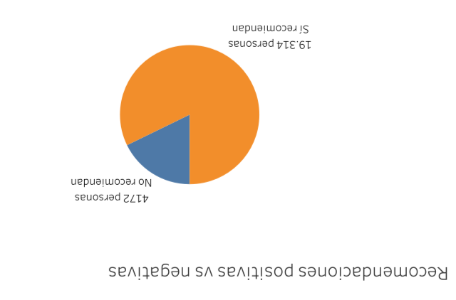
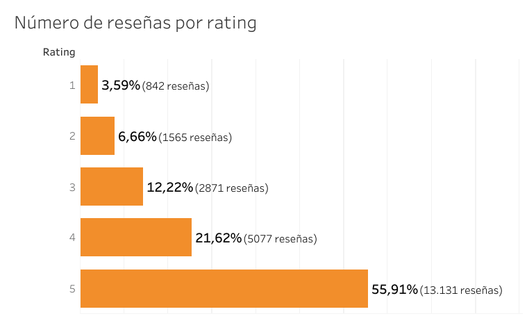
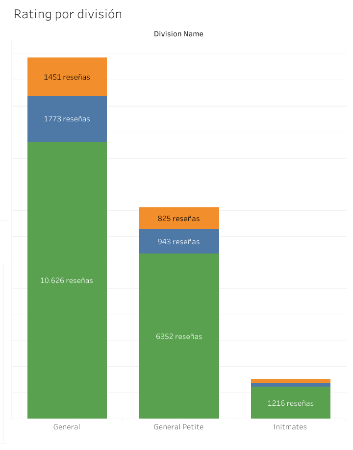

# 👗 Great Fit Dashboard – Análisis en Tableau Public

Este proyecto fue desarrollado en **Tableau Public** con el objetivo de analizar la percepción y satisfacción de los empleados dentro de la compañía **Great Fit SRL**, a partir de las reseñas y calificaciones recopiladas.  
El dashboard ofrece una visión clara del nivel de recomendación, la distribución de calificaciones y el desempeño por división, apoyando la toma de decisiones en el área de Recursos Humanos.

---

## 🎯 Objetivo
Diseñar un **dashboard interactivo** que permita visualizar las tendencias de satisfacción y recomendaciones de los empleados, identificando divisiones con mayor o menor desempeño general.

---

## 🧠 Fuente de datos
Los datos provienen del archivo **HRDataset.csv**, el cual contiene información sobre reseñas, calificaciones y divisiones de los empleados.  
Principales campos utilizados:
- `Rating` – Calificación otorgada (1 a 5)
- `Division Name` – División o área de la empresa
- `Recommend` – Indica si el empleado recomienda o no la empresa

---

## 📊 Principales gráficos y análisis

### 🥧 Recomendaciones positivas vs negativas

- **Tipo:** Gráfico de pastel  
- **Descripción:** Muestra la proporción de empleados que recomiendan la empresa frente a los que no.  
- **Resultado:**  
  - ✅ 19,314 personas **sí recomiendan**  
  - ❌ 4,172 personas **no recomiendan**  
- **Interpretación:** La mayoría de los empleados tiene una percepción positiva de la organización, con más del 80% que la recomendaría a otros.

---

### 📉 Número de reseñas por rating

- **Tipo:** Gráfico de barras horizontales  
- **Descripción:** Representa la cantidad y porcentaje de reseñas según la calificación (rating) de 1 a 5.  
- **Resultado:**  
  - ⭐ 5 estrellas: **55.91% (13,131 reseñas)**  
  - ⭐ 4 estrellas: **21.62% (5,077 reseñas)**  
  - ⭐ 3 estrellas: **12.22% (2,871 reseñas)**  
  - ⭐ 2 estrellas: **6.66% (1,565 reseñas)**  
  - ⭐ 1 estrella: **3.59% (842 reseñas)**  
- **Interpretación:** La mayoría de las reseñas son positivas, indicando una alta satisfacción laboral dentro de la empresa.

---

### 🧱 Rating por división

- **Tipo:** Gráfico de barras apiladas  
- **Descripción:** Compara el número de reseñas por división, mostrando su distribución por niveles de rating.  
- **Resultado:**  
  - **General:** 10,626 reseñas  
  - **General Petite:** 6,352 reseñas  
  - **Intimates:** 1,216 reseñas  
- **Interpretación:** La división *General* concentra la mayor cantidad de reseñas y calificaciones, reflejando mayor participación y posiblemente una plantilla más grande.

---

## 🌐 Visualización interactiva
Explora el dashboard completo en Tableau Public:  
👉 [Ver Dashboard en Tableau Public](https://public.tableau.com/shared/QGNCRJ3GN?:display_count=n&:origin=viz_share_link)

---

## 🧩 Herramientas utilizadas
- Tableau Public  
- Microsoft Excel / CSV  
- GitHub para documentación  

---

## 💡 Conclusión
El dashboard **Great Fit** proporciona una visión global del grado de satisfacción de los empleados.  
Los resultados reflejan una empresa con **altos niveles de recomendación y calificaciones positivas**, donde la mayoría de los empleados se sienten satisfechos con su experiencia laboral.  
Este tipo de análisis permite al área de Recursos Humanos implementar estrategias que fortalezcan la retención de talento y la motivación del personal.

---

© 2025 – **Diana Artemisa Sepúlveda Patiño**  
Proyecto académico elaborado para el diplomado Análisis de Datos*.
